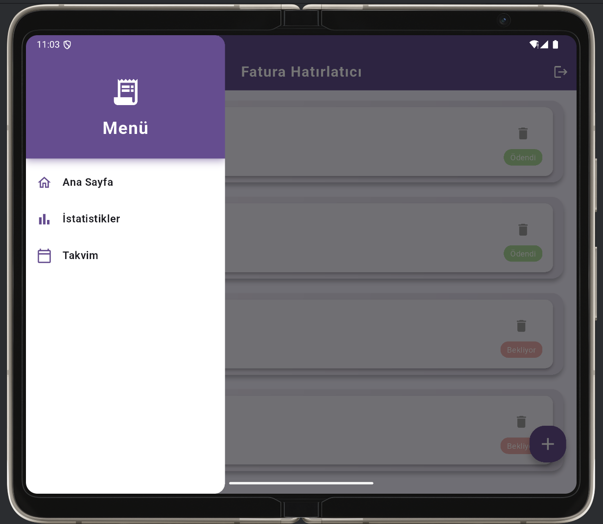
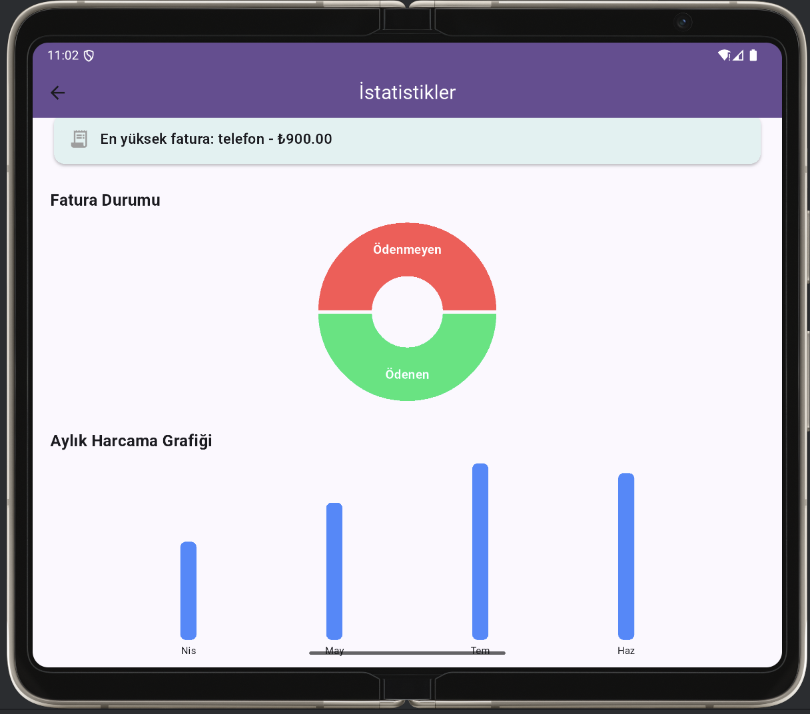
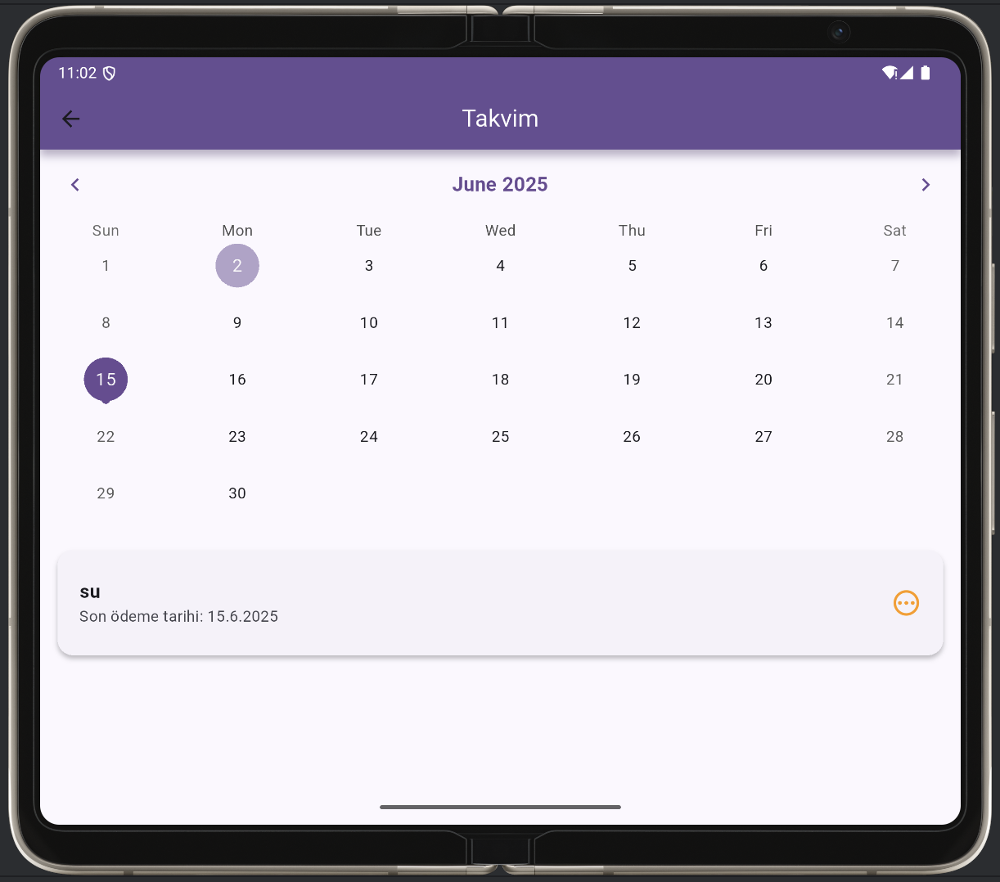

# 📱 Fatura Hatırlatıcı Uygulaması

Bu Flutter uygulaması, kullanıcıların fatura takibini kolaylaştırmak, faturalarını düzenli ve zamanında ödemelerini sağlamak amacıyla geliştirilmiştir. Kullanıcılar, kayıt ve giriş işlemlerini gerçekleştirdikten sonra, faturalarını ekleyebilir, ödeme durumlarını takip edebilir, takvim ve grafiklerle analiz yapabilirler.
---
## 🧭 Sayfaların Görevleri ve İçerikleri

| Sayfa                  | Görevi                                                                                              |
|------------------------|---------------------------------------------------------------------------------------------------|
| `LoginScreen`          | Kullanıcı adı ve şifre ile giriş yapılır                                                          |
| `RegisterScreen`       | Yeni kullanıcı kayıt işlemleri yapılır                                                            |
| `HomeScreen`           | Faturaların listelendiği, silindiği ve durumunun güncellendiği ana sayfa                           |
| `AddBillScreen`        | Yeni fatura ekleme sayfası                                                                        |
| `StatisticsScreen`     | Aylık fatura grafikleri, ödeme durumu dağılımı ve en yüksek fatura analizi                          |
| `CalendarScreen`       | Faturaların takvim üzerinde tarih bazında gösterildiği sayfa. Seçilen tarihe ait faturalar listelenir |
| `FilteredBillsScreen`  | Ödenen veya ödenmeyen faturaların filtrelenip listelendiği sayfa                                  |
| `MonthBillsScreen`     | Belirli bir aya ait faturaların listelendiği sayfa                                                |

---

## 🚀 Projenin Öne Çıkan Özellikleri

- 👤 Kullanıcı Kayıt ve Giriş Sistemi (Hive tabanlı lokal yönetim)
- 📌 Fatura Ekleme, Silme ve Ödeme Durumu Güncelleme
- ⏰ Faturaların ödeme durumunu takip etme (Ödendi / Bekliyor)
- 📅 Takvim görünümü ile faturaların tarih bazında takibi
- 🔍 Ödeme durumuna göre fatura filtreleme ve görüntüleme
- 📊 Aylık harcama ve ödeme durumu istatistikleri (grafiklerle)
- 🔔 Yerel bildirim desteği ile ödeme hatırlatmaları
- 📱 Modern, kullanıcı dostu ve mobil uyumlu tasarım
- 🗃️ Hive ile offline veri saklama ve yönetim

---

## 🚀 Yeni Eklenen Özellikler ve Sayfalar

- 📅 **Takvim Görünümü (`CalendarScreen`):**  
  Kullanıcılar faturalarını tarih bazında takvim üzerinde görebilir, seçilen güne ait faturaları detaylı listeleyebilir. Böylece tarih odaklı takip kolaylaşır.

- 🔍 **Filtrelenmiş Fatura Listesi (`FilteredBillsScreen`):**  
  Ödeme durumu bazında (Ödenen / Ödenmeyen) faturalar filtrelenip kullanıcıya gösterilir. Hızlı erişim ve durum takibi sağlar.

- 🗓️ **Aylık Fatura Listesi (`MonthBillsScreen`):**  
  Kullanıcı, grafiklerden veya diğer ekranlardan erişerek belirli bir ayın tüm faturalarını detaylı şekilde listeleyebilir.

- 📊 **Grafik ve İstatistik İyileştirmeleri:**  
  Ödeme durumuna göre pasta grafik ve aylık harcama bar grafiklerinde kullanıcı etkileşimi sağlanarak detaylı bilgilere ulaşım kolaylaştırıldı.

---

## 📱 Sayfa Açıklamaları

1. **Giriş Ekranı (`LoginScreen`)**
    - Kullanıcılar, kullanıcı adı ve şifre ile giriş yapabilir.
    - Hatalı giriş durumunda kullanıcı bilgilendirilir.
    - Başarılı giriş sonrası kullanıcı ana sayfaya yönlendirilir.
    - "Kayıt Ol" sayfasına yönlendirme bağlantısı içerir.

2. **Kayıt Ekranı (`RegisterScreen`)**
    - Yeni kullanıcılar için kullanıcı adı ve şifre kayıt formu sağlar.
    - Kullanıcı adı tekrar kontrolü yapar.
    - Başarılı kayıt sonrası otomatik giriş yapılır ve ana sayfaya yönlendirilir.

3. **Ana Sayfa (`HomeScreen`)**
    - Kullanıcının fatura listesi gösterilir.
    - Faturalar listelenir, silinebilir ve ödeme durumu değiştirilebilir.
    - Menü üzerinden diğer sayfalara (istatistikler, takvim) erişim sağlar.
    - Yeni fatura ekleme butonu bulunur.

4. **Yeni Fatura Ekleme (`AddBillScreen`)**
    - Fatura başlığı, tutar ve son ödeme tarihi girilir.
    - Tarih seçiminde takvim widget kullanılır.
    - Form validasyonu ile eksik ya da hatalı girişler engellenir.

5. **İstatistikler Sayfası (`StatisticsScreen`)**
    - Kullanıcının ödenen ve ödenmeyen faturaları pasta grafik ile gösterilir.
    - Aylık harcama tutarları bar grafik şeklinde sunulur.
    - Grafiklere dokunulduğunda detaylı fatura listesine erişim sağlanır.

6. **Takvim Görünümü (`CalendarScreen`)**
    - Faturalar tarih bazında takvimde işaretlenir.
    - Seçilen güne ait faturalar alt listede detaylı gösterilir.

7. **Filtrelenmiş Fatura Listesi (`FilteredBillsScreen`)**
    - Ödeme durumuna göre (ödenen veya ödenmeyen) faturalar filtrelenip listelenir.
    - Kullanıcı kolayca ödeme durumuna göre fatura görüntüleyebilir.

8. **Aylık Fatura Listesi (`MonthBillsScreen`)**
    - Belirli bir ayın tüm faturaları detaylı şekilde listelenir.
    - Grafiklerden ya da diğer sayfalardan erişilebilir.

---

## 🔐 Giriş Bilgileri Nasıl Saklanıyor?

- Kullanıcı kayıt bilgileri Hive veritabanında (`users` kutusu) saklanmaktadır.
- Giriş yapıldığında `auth` adlı Hive kutusuna kullanıcı ID’si kaydedilir.
- Uygulama her açıldığında `auth` kutusu kontrol edilerek oturum devam ettirilir.

---

## 🧩 Diğer Anlatmak İstediklerim

- Proje %100 Flutter ile yazılmıştır.
- Tüm veriler lokal olarak Hive ile saklanır, internet bağlantısı gerektirmez.
- Uygulama sade, modern ve kullanıcı dostu bir arayüze sahiptir.
- Grafikler için `fl_chart` paketi kullanılmıştır.
- Uygulamanın launcher ikonu ve splash ekranı özelleştirilmiştir.

---

### 🔐 Giriş Ekranı


### 🏠 Ana Sayfa


### 🏠 Ana Sayfa


### 📊 İstatistikler


### 📊 Fatura Ekleme Ekranı


### 📅 Takvim Ekranı


---

## 🛠️ Kurulum

1. Flutter ortamınızı hazırlayın:
   ```bash
   flutter pub get
   ```

2. İkonları ve splash ekranı oluşturmak için:
   ```bash
   flutter pub run flutter_launcher_icons:main
   flutter pub run flutter_native_splash:create
   ```

3. Uygulamayı başlatın:
   ```bash
   flutter run
   ```

---

## ▶️ Kullanım

1. Uygulama açıldığında giriş yapın veya kayıt olun
2. Ana ekranda faturalarınızı ekleyin
3. Ödeme durumunu tek tıkla güncelleyin
4. Menüden "İstatistikler"e tıklayarak grafiklere ulaşın

---

## 👥 Katkıda Bulunanlar

| Üye Adı      | Görevleri                                                                                                       |
|--------------|------------------------------------------------------------------------------------------------------------------|
| Handan İpek  | Proje fikri geliştirme, tüm sayfaların tasarımı ve kodlaması, login/kayıt sistemi, Hive veri yönetimi, grafik ekranı, kullanıcı kontrolü, splash/icon tasarımı, README oluşturma |
| Betül Zeybek | Sayfa bağlantıları ve yönlendirmeler, drawer menü ve ikon ayarları, bildirim entegrasyonu, fatura ekleme/silme testleri, kullanıcı deneyimi geri bildirimleri |
