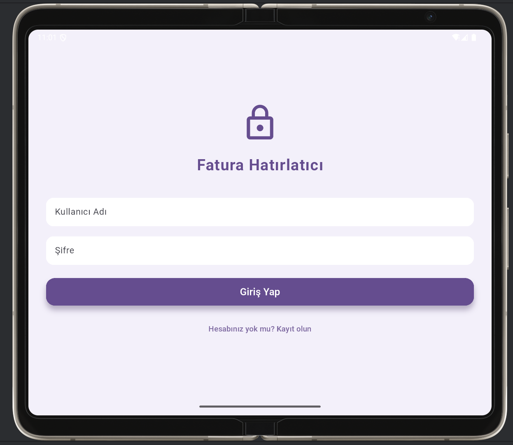
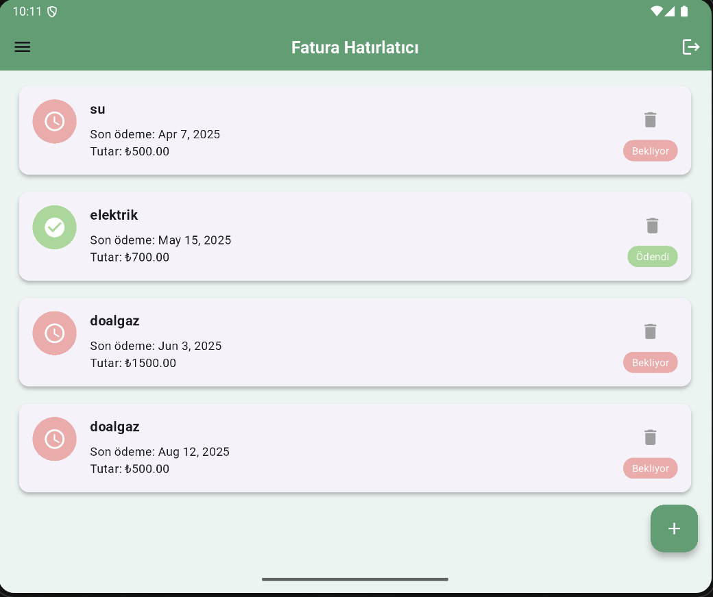
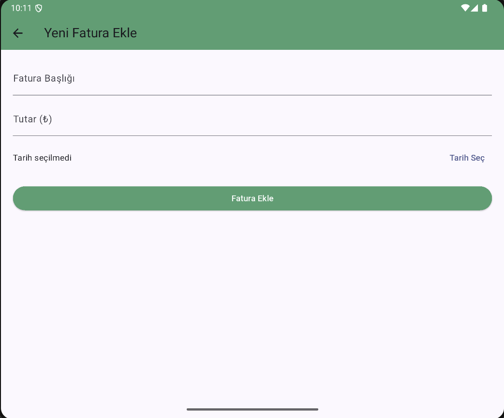

# 📱 Fatura Hatırlatıcı Uygulaması

Bu Flutter uygulaması, kullanıcıların fatura takibini kolaylaştırmak ve zamanında ödeme yapmalarını sağlamak amacıyla geliştirilmiştir. Kullanıcılar, giriş/kayıt işlemlerini gerçekleştirdikten sonra fatura bilgilerini ekleyebilir, ödeme durumlarını takip edebilir ve istatistiklerle analiz yapabilirler.

---

## 🚀 Özellikler

- 👤 Kullanıcı Kayıt ve Giriş Sistemi
- 📌 Fatura Ekleme, Silme ve Düzenleme
- ⏰ Ödeme Durumu Takibi (Ödendi / Bekliyor)
- 📊 Aylık Harcama ve Durum İstatistikleri (grafiklerle)
- 🔔 Yerel Bildirim Desteği (isteğe bağlı)
- 📱 Mobil Uyumlu Modern Tasarım
- 🗃️ Hive ile Lokal Veri Saklama

---

### 🔐 Giriş Ekranı


### 🏠 Ana Sayfa


### 📊 İstatistikler


### 📊 Fatura EKleme EKranı


## 🛠️ Kurulum

1. Flutter ortamınızı hazırlayın:
   ```bash
   flutter pub get
   ```

2. İkonları ve splash ekranı oluşturmak için:
   ```bash
   flutter pub run flutter_launcher_icons:main
   flutter pub run flutter_native_splash:create
   ```

3. Uygulamayı başlatın:
   ```bash
   flutter run
   ```

---

## ▶️ Kullanım

1. Uygulama açıldığında giriş yapın veya kayıt olun
2. Ana ekranda faturalarınızı ekleyin
3. Ödeme durumunu tek tıkla güncelleyin
4. Menüden "İstatistikler"e tıklayarak grafiklere ulaşın

---

## 🧩 Kullanılan Teknolojiler

- **Flutter**
- **Provider** – State Management
- **Hive** – Lokal Veri Tabanı
- **Intl** – Tarih Formatlama
- **fl_chart** – Grafik ve İstatistikler
- **flutter_launcher_icons** – Uygulama İkonu
- **flutter_local_notifications / awesome_notifications** – Bildirim sistemi

---

## 👥 Katkıda Bulunanlar

- Handan İpek
- Betül Zeybek
---
