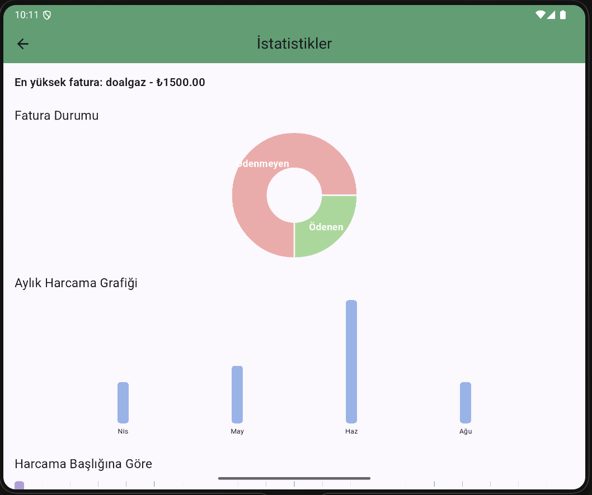

# 📱 Fatura Hatırlatıcı Uygulaması

Bu Flutter uygulaması, kullanıcıların fatura takibini kolaylaştırmak ve zamanında ödeme yapmalarını sağlamak amacıyla geliştirilmiştir. Kullanıcılar, giriş/kayıt işlemlerini gerçekleştirdikten sonra fatura bilgilerini ekleyebilir, ödeme durumlarını takip edebilir ve istatistiklerle analiz yapabilirler.

---
## 🧭 Sayfaların Görevleri ve İçerikleri

| Sayfa | Görevi |
|-------|--------|
| `LoginScreen` | Kullanıcı adı ve şifre ile giriş yapılır |
| `RegisterScreen` | Yeni kullanıcı kayıt işlemleri yapılır |
| `HomeScreen` | Faturaların listelendiği, silindiği ve durumunun güncellendiği ana sayfa |
| `AddBillScreen` | Yeni fatura ekleme sayfası |
| `StatisticsScreen` | Aylık fatura grafikleri, ödeme durumu dağılımı ve en yüksek fatura analizi |

---

## 🚀 Özellikler

- 👤 Kullanıcı Kayıt ve Giriş Sistemi
- 📌 Fatura Ekleme, Silme ve Düzenleme
- ⏰ Ödeme Durumu Takibi (Ödendi / Bekliyor)
- 📊 Aylık Harcama ve Durum İstatistikleri (grafiklerle)
- 🔔 Yerel Bildirim Desteği (isteğe bağlı)
- 📱 Mobil Uyumlu Modern Tasarım
- 🗃️ Hive ile Lokal Veri Saklama

---
## 🔐 Giriş Bilgileri Nasıl Saklanıyor?

- Kullanıcı kayıt bilgileri Hive veritabanında (`users` kutusu) saklanmaktadır.
- Giriş yapıldığında `auth` adlı Hive kutusuna kullanıcı ID’si kaydedilir.
- Uygulama her açıldığında `auth` kutusu kontrol edilerek oturum devam ettirilir.

---

## 🧩 Diğer Anlatmak İstediklerim

- Proje %100 Flutter ile yazılmıştır.
- Tüm veriler lokal olarak Hive ile saklanır, internet bağlantısı gerektirmez.
- Uygulama sade, modern ve kullanıcı dostu bir arayüze sahiptir.
- Grafikler için `fl_chart` paketi kullanılmıştır.
- Uygulamanın launcher ikonu ve splash ekranı özelleştirilmiştir.

---
### 🔐 Giriş Ekranı


### 🏠 Ana Sayfa


### 📊 İstatistikler


### 📊 Fatura EKleme EKranı


## 🛠️ Kurulum

1. Flutter ortamınızı hazırlayın:
   ```bash
   flutter pub get
   ```

2. İkonları ve splash ekranı oluşturmak için:
   ```bash
   flutter pub run flutter_launcher_icons:main
   flutter pub run flutter_native_splash:create
   ```

3. Uygulamayı başlatın:
   ```bash
   flutter run
   ```

---

## ▶️ Kullanım

1. Uygulama açıldığında giriş yapın veya kayıt olun
2. Ana ekranda faturalarınızı ekleyin
3. Ödeme durumunu tek tıkla güncelleyin
4. Menüden "İstatistikler"e tıklayarak grafiklere ulaşın

---

## 🧩 Kullanılan Teknolojiler

- **Flutter**
- **Provider** – State Management
- **Hive** – Lokal Veri Tabanı
- **Intl** – Tarih Formatlama
- **fl_chart** – Grafik ve İstatistikler
- **flutter_launcher_icons** – Uygulama İkonu
- **flutter_local_notifications / awesome_notifications** – Bildirim sistemi

---

## 👥 Katkıda Bulunanlar

| Üye Adı      | Görevleri                                                                                                       |
|--------------|------------------------------------------------------------------------------------------------------------------|
| Handan İpek  | Proje fikri geliştirme, tüm sayfaların tasarımı ve kodlaması, login/kayıt sistemi, Hive veri yönetimi, grafik ekranı, kullanıcı kontrolü, splash/icon tasarımı, README oluşturma |
| Betül Zeybek | Sayfa bağlantıları ve yönlendirmeler, drawer menü ve ikon ayarları, bildirim entegrasyonu, fatura ekleme/silme testleri, kullanıcı deneyimi geri bildirimleri |
